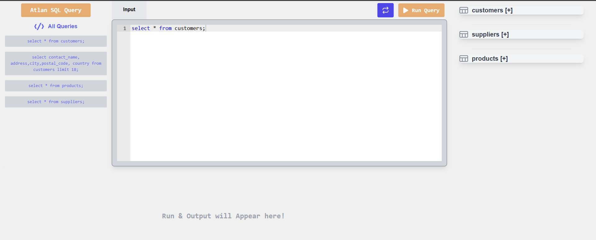

# 💻 REACT SQL Editor

## 📚 Description

Create, design and implement a web-based application capable of running SQL queries and displaying the results of said query. The application must include a space which accepts SQL queries in the form of user inputs, then runs the given query, and displays the result within the application..

This is a REACT SQL Editor built using ReactJs.

## 👨‍💻 Live Demo

Try out the website : [REACT SQL Editor](https://sql-editor-three.vercel.app/)

## 👨‍🔧 Tech Stack

## ⚙️ Dependencies

- **_react-ace_**
- **_react-csv_**
- **_react-hot-toast_**

## 👨‍💻 Features

:white_check_mark: Users can retrieve data from predefined SQL queries available in the left sidebar menu.\
:white_check_mark: Users can view all table columns in the right sidebar menu.\
:white_check_mark: Users can check all table values by clicking on a table name in the right sidebar menu.\
:white_check_mark: Users can download the data in CSV format with a single click.\

## ✍️ Predefined SQL Queries

- `select * from customers;`
- `select * from suppliers;`
- `select * from products;`
- `select contact_name, address,city,postal_code, country from customers limit 18;`

## ⏱ Page Load Time

Page Load time of this website in desktop is in the range of 0.4 s to 0.6s.

### [web.dev Report](https://pagespeed.web.dev/)

Laptop performance : Optimized

## Steps I took to optimize the page load time

-Utilized Lighthouse DevTools Extension to identify performance issues and implemented actionable recommendations for optimization.

-Deployed the website on Vercel to take advantage of its Edge Network compression, enhancing overall performance.

## Available Scripts

In the project directory, you can run:

### `npm install`

To install all the packages in package.json. This will install all the dependencies and devDependencies.

### `npm start`

Runs the app in the development mode.\
Open [http://localhost:3000](http://localhost:3000) to view it in the browser.

The page will reload if you make edits.\
You will also see any lint errors in the console.

### `npm run build`

Builds the app for production to the `build` folder.\
It correctly bundles React in production mode and optimizes the build for the best performance.

The build is minified and the filenames include the hashes.\
Your app is ready to be deployed!

## 🚀 Project Output

